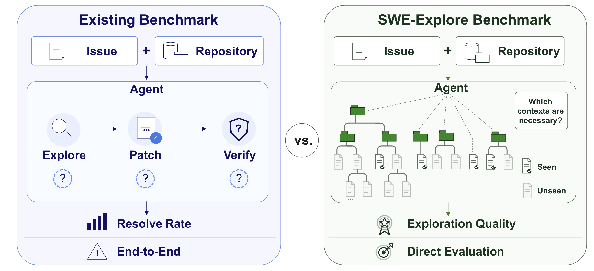
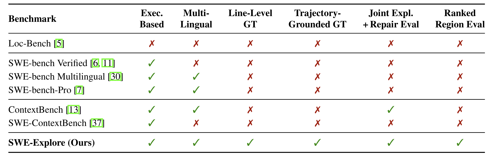
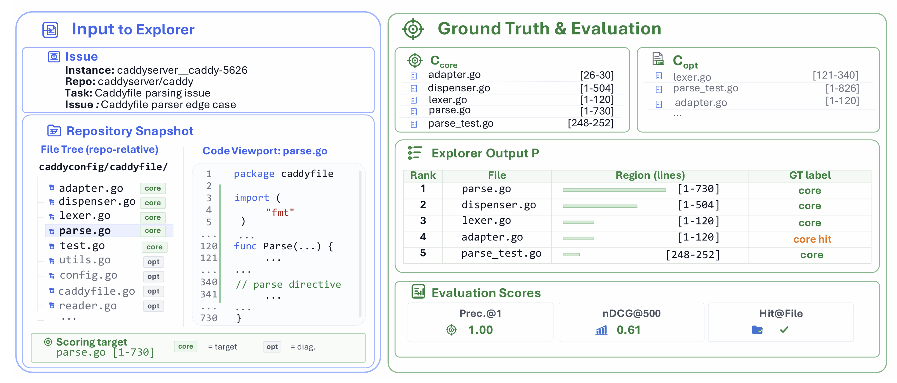

# SWE-Explore: Benchmarking How Coding Agents Explore Repositories


<p align="center">
  <a href="https://arxiv.org/abs/2606.07297"></a>
  <a href="https://huggingface.co/datasets/SWE-Explore-Bench/SWE-Explore-Bench"></a>
  <a href="https://github.com/Qiushao-E/SWE-Explore-Bench"></a>
  
  <a href="LICENSE"></a>
</p>

SWE-Explore-Bench is a trajectory-grounded benchmark for evaluating how well coding agents **explore, localize, and rank repository context** before editing code. Given a real issue and a repository snapshot, an explorer returns a ranked list of source files and line ranges. SWE-Explore scores those regions against line-level ground truth distilled from successful repair trajectories.

<p align="center">
  
</p>

## News

- **2026-06-08**: Paper, code, and dataset released.

## Links

| Resource | Link |
| --- | --- |
| Paper | [arXiv:2606.07297](https://arxiv.org/abs/2606.07297) |
| Dataset | [SWE-Explore-Bench/SWE-Explore-Bench](https://huggingface.co/datasets/SWE-Explore-Bench/SWE-Explore-Bench) |
| Code | [Qiushao-E/SWE-Explore-Bench](https://github.com/Qiushao-E/SWE-Explore-Bench) |

## Why SWE-Explore?

Repository-level coding benchmarks usually evaluate the whole repair pipeline with a final resolved/unresolved signal. That is useful, but it hides whether an agent actually found the right context. SWE-Explore isolates the exploration stage:

- **Direct exploration evaluation**: evaluate the code regions an agent reads or returns, before any patch is generated.
- **Trajectory-grounded labels**: derive core and optional context from independent successful repair trajectories.
- **Line-level supervision**: score files, regions, and ranked line budgets instead of coarse file-only localization.
- **Repair-aware validation**: connect upstream exploration scores with restricted-context downstream patch validation.
- **Broad agent coverage**: compare classical retrievers, general coding agents, IDE agents, and specialized localizers under one interface.

<p align="center">
  
</p>

## Benchmark Overview

SWE-Explore constructs a benchmark record from multiple solved trajectories for the same issue. It extracts read actions, converts them into repository-relative line regions, aggregates consensus core context, keeps model-specific optional context, and evaluates ranked explorer outputs with coverage, ranking, efficiency, and downstream validation metrics.

<p align="center">
  
</p>

## Dataset

The released dataset contains **848 issues** across **203 open-source repositories** and **10 programming languages**. Each instance includes the issue, repository snapshot metadata, line-level core and optional ground truth, read-step provenance, and benchmark metadata.

<p align="center">
  
</p>

## Instance Anatomy

Each benchmark instance asks an explorer to inspect a repository snapshot for one issue and return ranked regions:

<p align="center">
  
</p>

## Main Results

SWE-Explore evaluates exploration quality at a fixed ranked-region budget. The paper reports that agentic explorers form a clear tier above classical retrieval, while line-level coverage and efficient ranking remain challenging even when file-level hits are strong. The table below mirrors the paper results; the explorer wrappers currently registered in this repository are listed in the Quick Start section.

<p align="center">
  
</p>

## Quick Start

### 1. Install

```bash
uv sync
```

Requirements:

- Python 3.12+
- `uv` for environment management
- An OpenAI-compatible endpoint for LLM line refinement or agent explorers
- Optional external CLIs/SDKs for agent explorers such as Claude Code, Cursor, OpenCode, DevEco Code, AutoCodeRover, CoSIL, LocAgent, OrcaLoca, Mini-SWE-Agent, and AweAgent

### 2. Download the benchmark

Load the released benchmark from Hugging Face:

```python
from datasets import load_dataset

ds = load_dataset("SWE-Explore-Bench/SWE-Explore-Bench", split="train")
ds.to_json("bench.final.mixcap.jsonl")
```

Or download the files directly:

```bash
huggingface-cli download SWE-Explore-Bench/SWE-Explore-Bench \
  --repo-type dataset \
  --local-dir data/SWE-Explore-Bench
```

### 3. Fetch repository snapshots

The evaluation code expects local repository snapshots under `repos/`. The helper downloads repositories at each trajectory's `base_commit` via the GitHub archive API, avoiding `.git` directories.

```bash
# Build instance_id -> base_commit map.
uv run python build_commit_map.py build -o commit_map.json

# Fetch repositories referenced by unified trajectories.
uv run python fetch_repos.py clone \
  --trajs-dir unify_trajs \
  --commit-map commit_map.json \
  --repos-dir repos

# Optional: inspect the repo/commit list without downloading.
uv run python fetch_repos.py list-repos \
  --trajs-dir unify_trajs \
  --commit-map commit_map.json
```

### 4. Run an explorer

`eval_runner.py` runs registered explorers over a benchmark file, supports resume, and can evaluate multiple `top_k` budgets.

```bash
uv run python eval_runner.py \
  --bench bench.final.mixcap.jsonl \
  --repos repos \
  --issue-map issue_map.json \
  --explorers bm25 tfidf claude_code \
  --top-k 5 \
  --output "results/{explorer}/top{k}.jsonl" \
  --workers 8 \
  --resume
```

`--issue-map` is optional when the benchmark file already contains `problem_statement`; otherwise it can provide `{instance_id: issue_text}`.

`--resume` continues the existing `--output` files instead of starting over:

- A case counts as done only when it is present in *every* `top_k` file. One that an interrupt left in some files but not others is dropped from disk and re-run, so it contributes exactly one row per budget and a resumed run reports the same numbers as an uninterrupted one.
- A case whose row records a failure is run again and its rows are replaced: a timeout or a rate limit is a reason to retry, not a verdict. Only a case the run selected is retried, so a failed row that `--limit` or `--instance-ids` excludes is left alone rather than deleted by a run that was never going to replace it. `--no-retry-failed` keeps those rows and treats the case as done. A row written before outcomes were recorded says nothing about how the case ended and is taken as done either way.
- Each explorer and budget needs a file of its own, so keep `{explorer}` and `{k}` in `--output`. A result row records no `top_k`, so budgets sharing one file cannot be told apart and the run stops rather than guess.
- If a `top_k` file is missing entirely — you added a budget, or changed `--output` — the run stops instead of discarding the rows the other budgets already hold.
- Every explorer's files are checked before the first one starts, so an unresumable layout stops the run right away rather than once the run reaches that explorer.
- The configuration must match the one that produced the files (see [Run manifest](#run-manifest)). If it differs — another model, CLI version, prompt, profile, bench file, issue map or retrieval setting — the run stops and lists what changed, qualified by the block it came from (`explorer_config.model: ...`), instead of blending two experiments into one table. Result files written before manifests existed carry none; they are adopted with a warning. A field one side does not know — the CLI could not answer `debug config` on that run, so it recorded `null` — is reported and stepped over rather than read as a change, so one slow startup does not cost every later resume.

Without `--resume` the output files are rewritten from scratch.

#### Case outcomes

Every case that is attempted gets exactly one row per budget, and the row records how it ended in `outcome`:

| Outcome | Meaning |
| --- | --- |
| `success` | The explorer returned an answer. For CLI agents that includes an answer that uses the `RELEVANT_FILES:` contract but names no region. |
| `timeout` | The run exceeded its time limit. |
| `provider_error` | A CLI agent reported `error` events on its stream and produced no answer, whether it exited non-zero or cleanly. |
| `invalid_output` | A CLI agent exited cleanly without error events but never produced an answer. |
| `binary_not_found` | The agent CLI went missing while the run was going. A binary that is already absent at startup stops the run there instead, with the install hint: it is a setup error, not a benchmark result. |
| `error` | A CLI agent exited non-zero with nothing on its stream — a bad flag or a broken configuration is not the provider's doing — or any other exception (a crash, a missing config file, ...). |

The four specific failure outcomes are reported by the `opencode` and `deveco` explorers. `claude_code` and `cursor` do not classify their failures yet: a timeout or a missing binary reaches the row as `error`, and a run that exits cleanly with no answer is still recorded as a `success` with no regions. They are scored identically either way — the rule below does not depend on the label — but their rows say less about why.

Scoring rule: **a failed case is scored as an empty answer** — every metric is 0 and it counts in every average. A failure is never cheaper than a bad answer, and how a failure surfaced (a non-zero exit, a clean exit with junk output, an exception) does not change the score. The row keeps the failure's message in `error` (otherwise `null`) and the tokens the case spent in `token_usage`. `error` holds the classified message only — `OpenCode CLI timed out after 600s`, or the collapsed messages of the stream's `error` events — never the agent's raw stdout or stderr, which is the model's own output and belongs in the log rather than in a result file that may be published. On a timeout the output the CLI produced before it was killed is still read, so the usage it reported is recorded.

A case whose repository checkout is missing is not attempted (with the default `--skip-missing-repo`): it gets no row and is counted as `not_attempted` in the summary below. With `--no-skip-missing-repo` the case is run after all, and the missing checkout is a failure like any other: an `error` row naming the path, scored as an empty answer.

Rows also record `repo_revision`, the git HEAD of the case's checkout when it is a git work tree (`null` for snapshots extracted from archives), and `explorer_config` for explorers that have one. For a CLI agent the row keeps the CLI and the model; the hashes, the version and the MCP map are identical in every row and live in the manifest beside the file.

#### Run manifest

Beside every result file `X.jsonl` the runner writes `X.manifest.json`:

```json
{
  "schema": 1,
  "explorers": {
    "opencode": {
      "manifest": {
        "explorer": "opencode",
        "bench_sha256": "…",
        "issues_sha256": "…",
        "explorer_config": {
          "cli": "OpenCode CLI", "cli_version": "1.18.29",
          "model": "swe-explore/gpt-5.4", "model_source": "config", "agent": "build",
          "prompt_sha256": "…", "profile_sha256": "…", "resolved_config_sha256": "…",
          "mcp_servers": {"serena": {"type": "local", "enabled": true}}
        },
        "recorded": {"created_at": "…", "bench_path": "…", "harness_revision": "…"}
      },
      "summary": {
        "5": {
          "cases": 100, "attempted": 98, "not_attempted": 2,
          "outcomes": {"success": 91, "timeout": 4, "provider_error": 3},
          "completion_rate": 0.91,
          "metrics": {"precision": 0.41},
          "token_usage": {"input": 1200000, "output": 90000},
          "token_usage_cases": 98
        }
      }
    }
  }
}
```

- `explorer`, `bench_sha256`, `issues_sha256` and `explorer_config` identify the experiment, and `--resume` compares them. `recorded` is informational, as is `explorer_config.model_source`, which says how the model was chosen rather than which one ran: pinning the model the configuration had already selected produces the same command line and resumes cleanly. Paths are recorded without this machine in them — relative to the working directory, or as a bare file name — so a manifest can be read on another checkout. `issues_sha256` covers the issue text every explorer is given, so a rewritten `--issue-map` is a different experiment even against the same bench.
- For `opencode` and `deveco`, `explorer_config` comes from the CLI itself, once per run: `--version`, and `debug config`, the configuration it resolves from all of its sources under the same isolated home a case runs in. That configuration is hashed with every credential redacted (`apiKey`, tokens, passwords, and the values of `environment` and `headers` maps), so **the manifest holds no secret** and rotating a key does not block a resume. `debug config` is asked with `--pure`, which resolves the configuration without plugins, so a plugin's config hook is not in `resolved_config_sha256`; the shipped profiles have no plugins, and a profile that gains one is identified by `profile_sha256` instead. `profile_sha256` hashes the files of the `--*-config-dir` profile — JSON files through the same redaction, so an inline key can be rotated there too — and skips what the CLI writes into the profile itself: the names its own `.gitignore` lists (OpenCode installs plugin dependencies there on first use: `node_modules`, `package.json`, a lockfile), desktop metadata such as `.DS_Store`, and the `.git` file a work tree carries, which holds a local absolute path. `prompt_sha256` hashes the prompt template and `--*-prompt-additions`.
- The model is always named on the command line: `--opencode-model` / `--deveco-model` if given (`model_source: "flag"`), otherwise the model of the agent in effect (`"agent"`) — the one `--opencode-agent` / `--deveco-agent` named, the configuration's default, or the one the CLI falls back to when neither is set — otherwise the top-level model of the resolved configuration (`"config"`). An agent outranks the top-level model, so pinning it cannot override the selection `--opencode-agent` / `--deveco-agent` made.
- Explorers that are not CLI agents record their own settings too: the chunked retrieval explorers record `chunk_size` and `chunk_overlap`, plus the model that scores those chunks where there is one (`embed` its backend, model and preset, `swerank` its embedding and reranking models, `potion` its model path); `rag` records the model it embeds with, `codenib` its policy and budgets, and the agentic and academic explorers their model. `bm25`, `tfidf` and the baselines have nothing beyond chunking to record. Resuming across a change to any of them is refused just the same.
- `summary` is written when an explorer finishes. `completion_rate` is `success / cases`, where `cases` is the number of cases the run selected, after `--limit`. Resuming counts only the rows for those cases, so a narrowed resume reports on the narrowed selection rather than on the rows the file happens to hold (the rows themselves are kept); `metrics` are averages over the attempted cases, failures included as zeros.

Available explorers include:

| Family | Explorers |
| --- | --- |
| Local retrieval | `bm25`, `codenib`, `tfidf`, `potion`, `rag`, `embed`, `swerank` |
| Simple baselines | `oracle`, `random`, `simple_rule` |
| Agentic CLIs | `claude_code`, `cursor`, `opencode`, `deveco` |
| Academic agents | `autocr`, `cosil`, `locagent`, `orcaloca`, `mini_swe_agent`, `awe_agent` |

`bm25`, `tfidf`, `potion`, `rag`, `embed`, `swerank`, and `simple_rule` share
source-file discovery through `iter_source_files` in
[`explorers/source_files.py`](explorers/source_files.py). That module is the
single source of truth: `DEFAULT_EXTENSIONS` defines supported file types,
`DEFAULT_EXCLUDED_DIRS` defines skipped directories, and the function's
docstring documents ordering, traversal, and configuration overrides.

Agent explorers can be routed through one OpenAI-compatible endpoint with `--academic-api-base`, `--academic-api-key`, and `--academic-model`; see `.env.example` and `configs/litellm_proxy.yaml`.

`opencode` and `deveco` (DevEco Code, a HarmonyOS fork of OpenCode) take a
config directory via `--opencode-config-dir` / `--deveco-config-dir`.
Credential-free, read-only example profiles for ArkTS projects, with semantic
navigation over MCP switchable on and off, are committed under
[`configs/cli_agents/`](configs/cli_agents/README.md) together with the
supported CLI versions, an end-to-end test on the handwritten ArkTS fixture,
and an opt-in smoke test against the real binaries.

The optional `codenib` explorer runs
[CodeNib](https://github.com/sysevol-ai/CodeNib)'s native repository explorer.
The default `bm25` policy is the measured, low-dependency compatibility control:

The same CodeNib runtime also provides revision-pinned integration contracts
for LocAgent, Agentless v1.5.0, CoSIL, and OrcaLoca SearchAgent without building
an agent-specific index. See CodeNib's
[agent integration matrix](https://docs.codenib.ai/agent_integrations/) for the
provider, policy, evaluation, and fidelity boundary of each integration.

```bash
uv pip install \
  "codenib @ git+https://github.com/sysevol-ai/CodeNib.git@99375dc88e22e6f7e23b764665b3edb20ee2893d"
uv run python eval_runner.py \
  --bench bench.final.public.jsonl \
  --repos repos \
  --issue-map issue_map.json \
  --explorers codenib \
  --top-k 5 \
  --output "results/{explorer}/top{k}.jsonl"
```

Pass `--no-codenib-auto-index` to require a current, prebuilt CodeNib manifest.
Use `--codenib-policy` to select `auto`, `dense`, `hybrid`, `hybrid_rerank`, or
`graph`; the runner asks CodeNib which manifest views that policy requires and
materializes only those views. Dense and hybrid policies require
`codenib[semantic]`, graph requires `codenib[graph]`, and `auto` can use
`codenib[full]`. Optional `--codenib-planning-budget` and
`--codenib-retrieval-level` controls are recorded in every result row. For
example:

```bash
uv pip install \
  "codenib[full] @ git+https://github.com/sysevol-ai/CodeNib.git@99375dc88e22e6f7e23b764665b3edb20ee2893d"
uv run python eval_runner.py \
  --bench bench.final.public.jsonl \
  --repos repos \
  --issue-map issue_map.json \
  --explorers codenib \
  --codenib-policy auto \
  --top-k 5 \
  --output "results/{explorer}/top{k}.jsonl"
```

The runner accepts either the workspace containing the `repos/` paths recorded
in the benchmark or the `repos/` directory itself. Only the published BM25 arm
has measured results in this PR; other policies require new runs rather than
backfilled scores.

The pinned Git install is temporary: PyPI `codenib==0.1.0` predates the
SWE-Explore compatibility API and native multi-view explorer. Replace it with
the next CodeNib package release once that release is available.

## Build the Benchmark From Trajectories

If you want to reconstruct the benchmark from raw or unified trajectories:

```bash
uv run python bench_build.py build \
  --trajs-dir unify_trajs \
  --output bench.jsonl \
  --repos repos \
  --model MODEL_REGEX \
  --instance-filter INSTANCE_REGEX \
  --repo-filter REPO_REGEX \
  --min-trajectories 3
```

Optional LLM refinement can tighten coarse read spans into line-level regions:

```bash
# Dry-run cost estimate.
uv run python line_refine.py refine bench.jsonl repos --dry-run -k 4

# Real refinement.
uv run python line_refine.py refine bench.jsonl repos \
  --output bench.refined.jsonl \
  --context-k 4
```

The builder detects file reads from:

1. `str_replace_editor` calls with `command="view"`
2. shell reads such as `cat`, `head`, `tail`, `grep`, and `sed -n`
3. fenced bash blocks containing the same read commands

## Benchmark Format

Each line in the benchmark JSONL is one instance:

```json
{
  "instance_id": "lincolnloop__goodconf-49",
  "repo_path": "/testbed",
  "repo_dir": "repos/goodconf",
  "ground_truth": {
    "read_core_files": ["goodconf/__init__.py", "pyproject.toml"],
    "read_core_regions": [
      {"path": "goodconf/__init__.py", "start": 1, "end": 343},
      {"path": "pyproject.toml", "start": 1, "end": 85}
    ],
    "read_optional_files_map": {"model_name": []},
    "read_optional_regions_map": {"model_name": []},
    "modified_core_files": ["goodconf/__init__.py"],
    "main_files": ["goodconf/__init__.py"]
  },
  "read_step_info": {},
  "meta": {}
}
```

| Field | Meaning |
| --- | --- |
| `instance_id` | SWE-style issue identifier |
| `repo_path` | Repository path placeholder inside trajectories |
| `repo_dir` | Local repository snapshot path relative to `--repos` |
| `read_core_files` / `read_core_regions` | Files and line regions read by every successful trajectory |
| `read_optional_files_map` / `read_optional_regions_map` | Model-specific diagnostic context read by some successful trajectories |
| `modified_core_files` | Files modified by every successful trajectory |
| `main_files` | Files that are both read and modified |
| `read_step_info` | Provenance for read steps, used by line refinement |
| `meta` | Instance-level metadata |

## Programmatic Evaluation

```python
from pathlib import Path
from eval import ExploreEvaluator

evaluator = ExploreEvaluator(
    bench_data_path=Path("bench.final.mixcap.jsonl"),
    file_line_counts=None,
)

results = evaluator.evaluate(
    explore_method=my_explorer,  # (issue, instance_id) -> list[(path, start, end)]
    instance_ids=["org__repo-123"],
    metrics=[
        "precision",
        "recall",
        "f1_score",
        "hit_file_rate",
        "noise_file_rate",
    ],
)
```

### Agent output parsing

Claude Code, Cursor, OpenCode, DevEco Code, Mini-SWE-Agent, and AweAgent use
[`parse_relevant_files`](explorers/parsing.py) to read locations such as:

```text
RELEVANT_FILES:
- entry/src/main/ets/pages/Index.ets:10-20
- entry/src/main/ets/model/DataSource.ets:5
- entry/src/main/ets/common/types.d.ets
```

Line numbers are 1-based and ranges are inclusive. `:5` means lines 5–5;
a path without line numbers means the whole file (`start=1`, `end=-1`).
The parser accepts whitespace around range separators, numbered lists, quoted
filenames, Markdown emphasis, `L10-L20` line labels, and Unicode range dashes.
Trailing columns (`:10:3`) and explanations are ignored. If a structured block
is absent or has no usable entries, the parser also checks surrounding prose.
Rejected entries inside the block are excluded from that search.

These explorers pass the actual checkout root as `repo_path`. Existing files
inside that root are returned as repository-relative paths with forward slashes;
leading `./`, backslashes, and absolute paths into the checkout are supported.
Known container paths such as `/testbed/...` or `.../repos/<name>/...` can also
map to an existing checkout file when the original path does not exist locally.
Existing outside files or directories are never remapped.
Missing files, paths outside the checkout (including symlink escapes), and
invalid or backwards ranges are logged and skipped before applying `top_k`.
Rejected structured entries are not retried through the prose fallback.

Custom callers should also pass `repo_path` to validate locations against their
checkout. Omitting it, or passing a blank string, keeps legacy normalization
without filesystem validation for archived output. This behavior applies to
`parse_relevant_files`; specialized JSON parsers and `parse_file_paths` have
separate contracts.

Run the parser and explorer integration regressions without external agent CLIs:

```bash
python3 -m unittest discover -s tests -p test_parsing.py
```

## Metrics

| Metric | Definition |
| --- | --- |
| `precision` | Line-level precision: predicted core lines divided by predicted lines |
| `recall` | Line-level recall: predicted core lines divided by core lines |
| `f1_score` | Harmonic mean of precision and recall |
| `hit_file_rate` | Fraction of core files reached |
| `noise_file_rate` | Fraction of predicted files that are neither core nor optional |
| `hit_region_rate` | Fraction of core regions overlapped by at least one prediction |
| `noise_region_rate` | Fraction of predicted regions overlapping neither core nor optional |
| `weighted_core_coverage` | Per-file recall weighted by ground-truth region size |
| `context_efficiency` | Core coverage divided by emitted context length |
| `recall_at_K` / `ndcg_at_K` | Rank-aware metrics over line budgets |
| `first_useful_hit` | Normalized rank of the first prediction that hits a core region |

See `eval.py::ExploreEvaluator` and `quality/bench_metrics.py` for exact formulas.

## Project Layout

```text
SWE-Explore-Bench/
|-- bench_build.py              # Build line-level ground truth from trajectories
|-- build_commit_map.py         # Build instance -> base_commit mappings
|-- fetch_repos.py              # Download repository snapshots
|-- line_refine.py              # LLM-based line-range refinement
|-- eval.py                     # ExploreEvaluator and metrics
|-- eval_runner.py              # CLI driver for all explorers
|-- stats.py                    # Benchmark-level statistics
|-- tests/                      # Test suite (see Tests below)
|-- explorers/                  # Retrieval, agentic, and academic explorer wrappers
|-- quality/                    # Downstream patch-quality validation
|-- traj_datasets/              # Trajectory loaders and unified Pydantic schema
|-- models/                     # LangChain-compatible LLM clients
|-- configs/                    # LiteLLM and runtime configs
|-- figures/                    # Paper figures used by this README
`-- pyproject.toml
```

## Tests

```bash
uv run --locked python -m pytest tests quality/tests/test_cli_agent_explorers.py
```

CI runs that on Linux and Windows with `PYTHONWARNDEFAULTENCODING=1`, so any text I/O that relies on the platform default encoding fails the suite — always pass `encoding="utf-8"` when opening or reading a text file, since the default is UTF-8 on Linux but cp1252 on Windows.

## Citation

If SWE-Explore-Bench is useful for your work, please cite:

```bibtex
@misc{zhang2026sweexplore,
  title = {{SWE-Explore}: Benchmarking How Coding Agents Explore Repositories},
  author = {Shaoqiu Zhang and Yuhang Wang and Jialiang Liang and Yuling Shi and Wenhao Zeng and Maoquan Wang and Shilin He and Ningyuan Xu and Siyu Ye and Kai Cai and Xiaodong Gu},
  year = {2026},
  eprint = {2606.07297},
  archivePrefix = {arXiv},
  primaryClass = {cs.SE},
  url = {https://arxiv.org/abs/2606.07297}
}
```

## License

This repository is released under the MIT License. Dataset artifacts are hosted on Hugging Face; please check the dataset card for data-specific terms.
